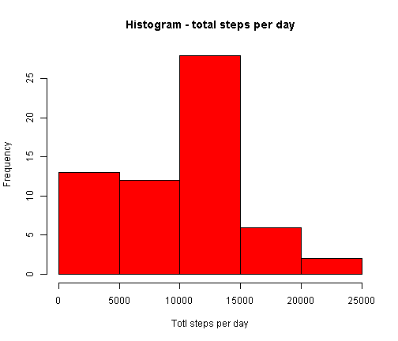
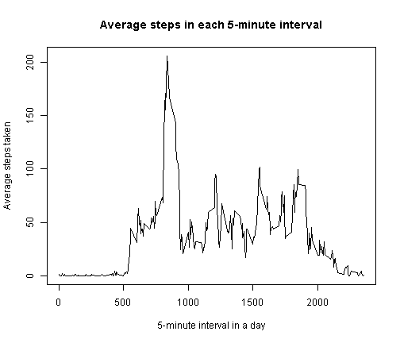
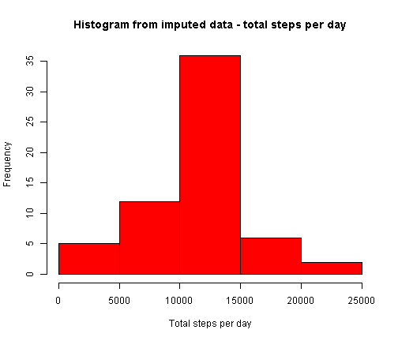
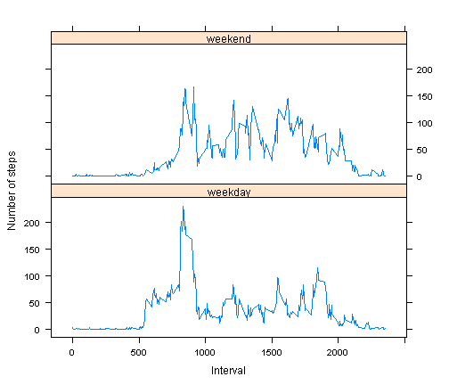

# RR Assignment 1: Analyses of activity monitoring data
========================================================

## Loading and preprocessing the data  

```r
data <- read.csv("activity.csv")
data$date <- as.Date(data$date)
```


## What is mean total number of steps taken per day?  

```r
stepsPerDay <- aggregate(data$steps, list(day = data$date), sum, na.rm = TRUE)
colnames(stepsPerDay) <- c("day", "steps")
hist(stepsPerDay$steps, col = "red", xlab = "Total steps per day", main = "Histogram - total steps per day")
```

 

```r
meanStepsPerDay <- mean(stepsPerDay$steps)
medianStepsPerDay <- median(stepsPerDay$steps)
```

### Summary of total number of steps taken per day 
Mean = 9354.2295  
Median = 10395

## What is the average daily activity pattern?

```r
stepsPerInterval <- aggregate(data$steps, list(interval = data$interval), mean, 
    na.rm = TRUE)
colnames(stepsPerInterval) <- c("interval", "steps")
plot(stepsPerInterval$interval, stepsPerInterval$steps, type = "l", main = "Average steps in each 5-minute interval", 
    xlab = "5-minute interval in a day", ylab = "Average steps taken")
```

 

```r
maxStepsIndex <- which.max(stepsPerInterval$steps)
maxInterval <- stepsPerInterval$interval[maxStepsIndex]
maxStepsPerInterval <- stepsPerInterval$steps[maxStepsIndex]
```

### Interval with max steps on average
#### The 5-minute interval "835" has the maximum number of steps (i.e. 206.1698), on average across all the days in the dataset.  

## Imputing missing values

```r
numMissing <- dim(data[is.na(data$steps), ])[1]
```

#### Total number of missing values: 2304  
Fill in the missing values in the dataset with the mean for that 5-minute interval (as computed above).


```r
# Merge original data with 5-minute interval means, based on 'interval'
# field
merged <- merge(data, stepsPerInterval, by.x = "interval", by.y = "interval")

# Inside 'merged', set data.steps = stepsPerInterval.steps where data.steps
# == NA
merged[is.na(merged$steps.x), "steps.x"] <- merged[is.na(merged$steps.x), "steps.y"]

# discard the last column
imputedData <- merged[, 1:3]
colnames(imputedData)[2] <- "steps"

imputedStepsPerDay <- aggregate(imputedData$steps, list(day = imputedData$date), 
    sum)
colnames(imputedStepsPerDay) <- c("day", "steps")
hist(imputedStepsPerDay$steps, col = "red", xlab = "Total steps per day", main = "Histogram from imputed data - total steps per day")
```

 

```r
meanImputedStepsPerDay <- mean(imputedStepsPerDay$steps)
medianImputedStepsPerDay <- median(imputedStepsPerDay$steps)
```

### Summary of total number of steps taken per day (from imputed data)
Mean = 1.0766 &times; 10<sup>4</sup>  
Median = 1.0766 &times; 10<sup>4</sup>  
  
Imputing NA-data leads to an increase in the total steps per day, as expected.

## Weekdays vs weekends

```r
# determine weekday/weekend
days <- weekdays(imputedData$date)
imputedData$typeOfDay <- ifelse(days %in% c("Saturday", "Sunday"), "weekend", 
    "weekday")

# comute mean(steps) group by (interval, weekday)
imputedStepsPerIntervalWeekday <- aggregate(imputedData$steps, list(interval = imputedData$interval, 
    typeOfDay = imputedData$typeOfDay), mean)
colnames(imputedStepsPerIntervalWeekday)[3] <- "steps"

library(lattice)
xyplot(steps ~ interval | typeOfDay, imputedStepsPerIntervalWeekday, layout = c(1, 
    2), type = "l", xlab = "Interval", ylab = "Number of steps")
```

 

